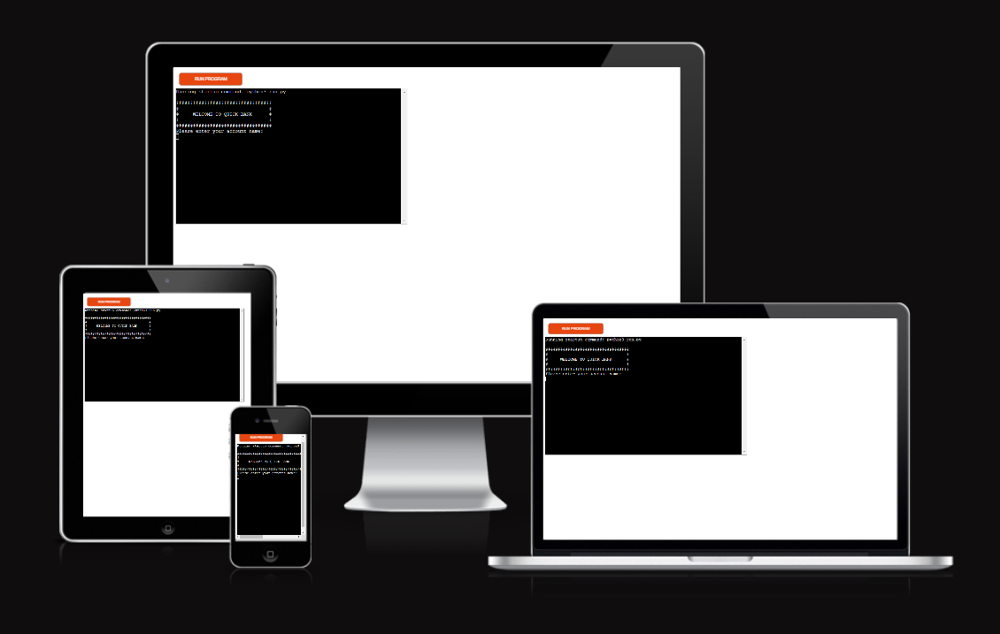
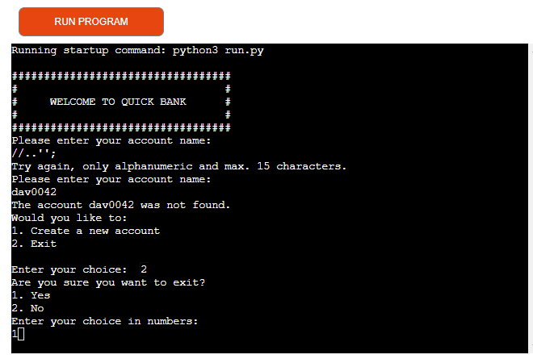
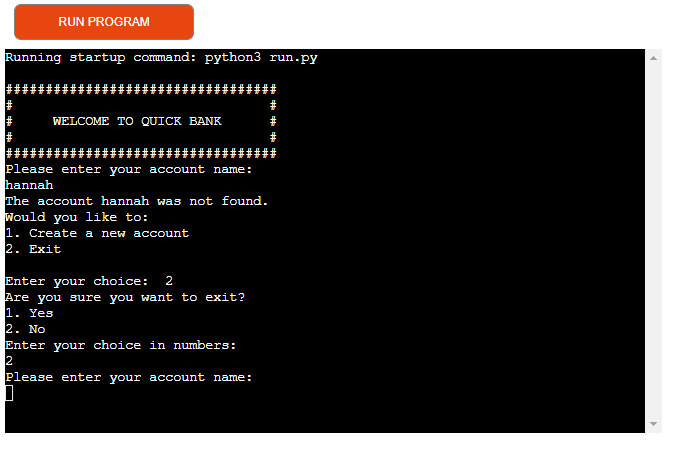
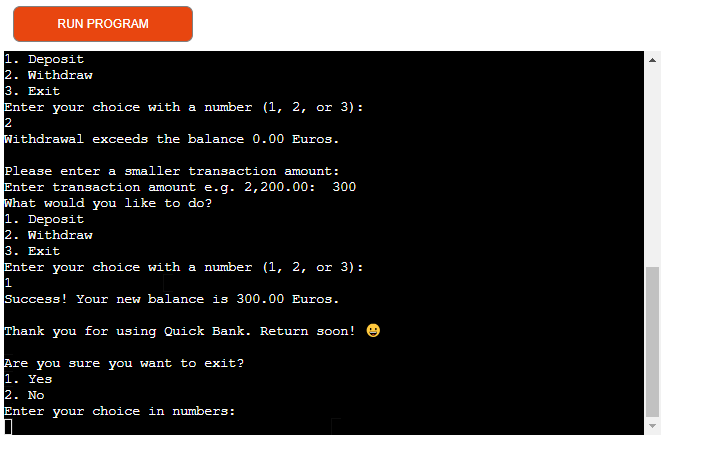
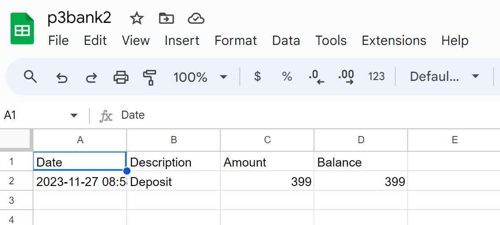
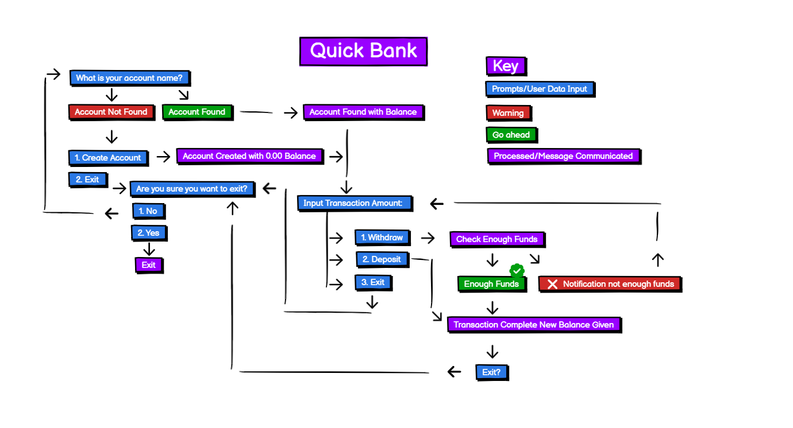
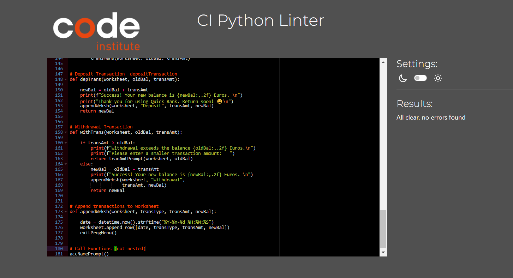

# Quick Bank
Quick Bank is a Python terminal banking application, which runs in the Code Institute mock terminal on Heroku.  It can be used by anyone that has worked with an account before. It is ideal for quick, efficient banking needs, especially for bulk accounts. This simple way of account keeping, is designed with the <b>minimal viable product</b> in mind that can easily be <b>scaled up</b> and future proofed on this programme's foundation.

The data is stored in a Google spreadsheet that is easy to access and read. Balances are communicated automatically before and after the transactions.  

The flow and input is designed with the user's comfort in mind. Minimal keystrokes and mouse use, is a priority.  Information is relayed in a concise way.  The user is prompted at every step, making for easy navigation.  

[Click on this hyperlink for a live version of the project.](https://p3-bank2-bedbb06cdecb.herokuapp.com/).

- - -

# Table of Contents
## [Navigation](#navigation-1)
### [How to input the Account Name](#how-to-input-the-account-name-1)
### [How to use the Numeric Menu](#how-to-use-the-numeric-menu-1)
### [How to input the Transaction Amount](#how-to-input-the-transaction-amount-1)
### [How to Exit](#how-to-exit-1)
### [How to Credit or Debit the Account](#how-to-credit-or-debit-the-account-1)
### [How to Receive a Balance](#how-to-receive-a-balance-1)
## [User Experience-(UX)](#user-experience-ux-1)
### [User Stories](#user-stories-1)
#### [First-time Visitor Goals](#first-time-visitor-goals-1)
#### [Returning User Goals](#returning-user-goals-1)
#### [Frequent User Goals](#frequent-user-goals-1)
## [Features](#features-1)
### [Existing Features](#existing-features-1)
#### [Intro Screen](#intro-screen-1)
#### [Account Name Prompt](#account-name-prompt-1)
#### [Exit Prompt](#exit-prompt-1)
#### [Create New Account](#create-new-account-1)
#### [Numerical Menu](#numerical-menu-1)
#### [Transaction Amount Prompt](#transaction-amount-prompt-1)
#### [Withdrawal](#withdrawal-1)
#### [Deposit](#deposit-1)
#### [Exit on End of Transaction](#exit-on-end-of-transaction-1)
#### [Date and Time Automatically Captured](#date-and-time-automatically-captured-1)
### [Future Features](#future-features-1)
## [Data Model](#data-model-1)
## [Design](#design-1)
## [Technologies Used](#technologies-used-1)
### [Language](#language-1)
## [Frameworks, Libraries and Programs](#frameworks-libraries-and-programs-1)
## [Testing](#testing-1)
### [Validator Testing](#validator-testing-1)
### [Manual Testing](#manual-testing-1)
### [Bugs](#bugs-1)
#### [Solved Bugs](#solved-bugs-1)
#### [Remaining Bugs](#remaining-bugs-1)
## [Deployment and Local Development](#deployment-and-local-development-1)
### [Deploying to Heroku](#deploying-to-heroku-1)
### [Forking with GitHub Repository](#forking-with-github-repository)
### [Local Clone](#local-clone-1)
## [Credits](#credits-1)
### [Code and Media](#code-and-media-1)
### [Content](#content-1)
## [Acknowledgements](#acknowledgements-1)

# Quick Bank
## Navigation 
The [logic flowchart](#design-1) gives a diagramatic layout of the programme. The user is guided by intuitive prompts from the programme from beginning to end.  

### How to input the Account Name
- The account name can be created by the user, making them easy to re-use. 
- Only alphanumerics can be used with a maximum of 15 characters for example, dave042.  
- The user is prompted if the account name is invalid with an opportunity to try again.
- The user is asked before an account name is created to prevent unnecessary duplications.
- The account name is automatically converted to lower case to prevent frustrating case sensitive security features which can come at a later stage when searching functions are available.

### How to use the Numeric Menu
- The user needs to select and input a number that relates to the options given.
- An invalid input will give the user another opportunity to try again, for example to type in the key '2' for the second option on the [menu](#numerical-menu-1).

### How to input the Transaction Amount
- The [transaction amount](#transaction-amount-prompt-1) can only be entered using numerics.  
- If the user uses decimal amounts, it is reflected. If not, the decimals are assumed to be nil.
- A period is used to indicate decimals (this may need to be adjusted in countries like the Netherlands where commas are used to indicate decimals.  Since the programe is written in English, it is presumed that users will use a period to indicate decimals).

### How to Exit
- The user will be prompted at regular intervals on the menu for an [exit](#exit-on-end-of-transaction-1) option.  If exit is selected, another prompt will appear on which the user can then select to go out of the programme or not.
- If the user selects not to go out of the programme, the account name input prompt appears.

### How to Credit or Debit the Account
- Withdrawals can be used for any debits, which will reduce the balance.
- Deposits can be used for any credits, which will increase the balance.

### How to Receive a Balance
- The user will be given a balance as soon as the account name is given and after a succesful transaction.

## User Experience (UX)
- I can keep track of my banking accounts in a quick and easy way with a lean <b>minimal viable product</b> approach.  
- I can do bulk data capture mainly using the keyboard with <b>fewer weight-shifting moments and fewer keystrokes</b>. 
- I am prompted with simple menu choices (no more than 3 at a time).
- The menu choices requires a number only preventing finger errors. 
- The layout is clear and well spaced so that I can navigate through the program landscape easily and quickly.  
- I can use the basic withdrawal and deposit options for any debits and credits on the account.
- I am prompted to exit at three crucial points for convenience - to either correct information input or to exit. 
- The flow is forgiving and predictive, supporting my decision making, as it unfolds.
- I am <b> set up for success</b>.  If my input is incorrect I am given another opportunity with clear instructions.
- The withdrawal amount that exceeds the balance is clearly communicated and a retry offered. I am then given the opportunity to deposit or correct the amount. There are no embarrassing exits which would require me to log in again.

### User Stories
#### First-time Visitor Goals
- As a first-time visitor, I understand what is required from me with short, succinct instructions.
- I am able to change my mind and start again quickly.
- I feel comfortable when there is not sufficient funds for a withdrawal and I am prompted to try again. 
- If I do bulk data capturing my right-hand can hover over the numpad.  I don't want to have it return to the keyboard or mouse. I can do that if my accountnames is typed with my left-hand. Three letters and three digits for account names make this easy for example, dave042 and fred007.
- My account balance is given to me automatically I don't have to request it.

#### Returning User Goals
- I don't want to have to remember which case I used for my accountname. 
- The account names must be easy to access. I don't want to be limited with numbers only or letters only.
- I should be asked <b>before</b> an account is created in case I made a finger error. 
- I can exit quickly if I am interrupted, since this is probably sensitive information that I cannot leave up on my screen for others to see. Three exit points are available at regular intervals for this. 
- Once the software is <b>scaled up</b>, this basic structure will provide a good basic plaform to continue the design on. 
- The user is then in a predicatable environment that makes the software easy to use.

#### Frequent User Goals
- When I return I can transact quickly and see what the new balance is. 
- The menu to be predictable and easy to navigate.
- I want a <b>forgiving data input standard</b> that will direct me to a prompt to try again automatically.

## Features
- The flow is created for an efficient and <b>intuitive</b> user experience. 
- Bulk data capture is <b>quick</b> and easy.
- Numeric menu selection items leave less room for finger error.

### Existing Features
#### Intro Screen
- A big welcome message is displayed to make the user feel welcome and at ease.
- A basic color scheme and evenly spaced instructions makes for a tranquil and calm experience. 

#### Account Name Prompt
- The accountname is converted to lowercase automatically avoiding annoying the user when the accountname is not found due to case sensitivity.
- Account names can be typed with a left-hand, leaving the right-hand open to hover over the numpad and mouse. 
- If the account name is not found, the user is prompted before inadvertantly creating an account that already exists.
- The accountname can accomodate alphanumeric keys allowing the user to use Identification numbers, or fullnames or unique names that are easy-to-reference.  
- If the user inadvertantly types anything but the alphanumeric characters, another opportunity to try again is prompted (this includes hitting enter with no input, a space, and other characters like "%$#@!").
- The account name is displayed in bold, so that the user can see what is typed. 

#### Exit Prompt
- The exit prompt is provided at regular intervals to ensure that the user is given the opportunity to correct input or exit.
- If the user selects 'no' to exit, the accountname prompt appears.

#### Create New Account
- The input is forgiving - prompts give another input opportunity automatically.

#### Numerical Menu
- Where possible a numerical selection prompt has been used, it is assumed that one hand hovers over the numpad anyway for financial work - so no shifting of weight is needed.

#### Transaction Amount Prompt
- The transaction decimal amount is automatically rounded to zero enabling the user to type in decimals.  If no decimals are entered, it is assumed it is zero.  If decimals are entered, it is taken into the calculations automatically.
- Where possible the menu requires a numeric selection, this is especially useful for quick bulk data capturing.

#### Withdrawal 
- The system will check if the funds are less than the balance.
- If the withdrawal exceeds the balance, an error message will encourage the user to try again with a smaller amount or to select deposit on the next menu.  
- Once the withdrawal is successful a message is displayed showing the new balance.

#### Deposit
- The deposit is added to the balance and a message displayed showing the new balance.

#### Exit on End of Transaction
- The user is prompted to exit or not to exit. If the user exits, the program is closed, if not the user is taken to the account name menu. This then allows for bulk data capturing efficiency because I can simply just type in the next account name without having to exit.
- The user is greeted with a wish for a quick return and a smiley face to close the transaction joyfully.

#### Date and Time Automatically Captured
- The transaction date and time is automatically captured in the data worksheet to save the user effort. 
- This timestamp also serves as a reference for multiple transactions on one day.
- It also gives the information more integrity for security reasons.

### Future Features
The programme has been <b>Future-proofed</b> with a basic layout that can easily be <b>Scaled up</b> for more complex features like:
- More account information like addresses and contact information.
- A secure entry system with authenticated passwords.
- A search list for current account names. 
- More secure Google worksheets for accounts and an option to archive unused accounts.
- The deposit and withdrawal basic structure can be used to bring in other debit or credit transactions with a description and reference number.
- A compound interest earned calculation on credit balances
- A transaction fee charge schedule.
- A statement and account history print out on request.
- A query and overdraft feature that can handle on-line applications or requests.
- International facilities could also be introduced further down the line, with live linking to currency exchange.
- Automated budget and payment systems.

## Data Model
Google Sheets is used to store account information for the application. Each user account name generates a new worksheet with it's own date and time, transaction type, amount and balance column. The date and time is automatically entered for security, <b>data integrity</b> and efficiency. Accounts can be deleted here if need be. The user can also do minimal account editing providing they stick to the current data structure! 

## Design
- Initially a wireframe was created with Lucid but could not be used due to limited user access on the unregistered package. After that a flowchart was created in [Balsamiq Wireframes](https://balsamiq.com/wireframes), which accurately reflected the changes that was made as the project progressed.
- The site has been designed with an "easy to take in" style focussed on avoiding decision fatigue and information overload.   
- Each stroke and click is efficient and intentional.

## Technologies Used
### Language
Python 3 is used.

## Frameworks, Libraries and Programs
- [Git](https://git-scm.com/) is used for version control.
- [Github](https://github.com/) is used to save and store files.
- [Lightshot](https://app.prntscr.com/en/index.html) is used for screendumps.
- [Heroku](https://id.heroku.com/) is used to deploy the project.
- [CI Python Linter](https://pep8ci.herokuapp.com/) is used to check the code.

## Testing
### Validator Testing
The project passed the code through a PEP8 linter with no problems.

## Manual Testing
| Test | Expected Behavior | Test Result |
| --- |--- |--- |
| Account Name input empty | Error message displayed and user is asked to try again | Passed |
| Account Name input non-alphanumeric characters | Error message displayed and user is asked to try again | Passed |
| Account Name input uppercase and lowercase |  Automatically convert to lowercase | Passed |
| Account Name input Enter key only | Error message displayed and user is asked to try again | Passed |
| Account Name input Spacebar key only | Error message displayed and user is asked to try again | Passed |
| Transaction Amount empty | Error message displayed and user is asked to try again | Passed |
| Transaction Amount non-numeric characters | Error message displayed and user is asked to try again | Passed |
| Transaction Amount no decimals given | Amount is displayed with no decimals | Passed |
| Transaction Amount with decimals | Amount is displayed with the given decimals | Passed |
| Transaction Amount Enter key only | Error message displayed and user is asked to try again | Passed |
| Transaction Amount Spacebar key only | Error message displayed and user is asked to try again | Passed |
| Withdrawal more than Balance | Error message displayed and user is asked to try again | Passed |

## Bugs
### Solved Bugs
- There were many parameter issues regarding the account name intially.  These are all fixed. 
- The sequencing of creating a new account had to be adjusted to ensure that the correct balance is given if the account is found. This was fixed by using nested functions and atomic style coding.
- The initial gspead import gave several issues, which were solved by updating imported library versions.

### Remaining Bugs
There are no bugs remaining.

## Deployment and Local Development
### Deploying to Heroku
This project is deployed using the Code Institute's mock terminal for Heroku with the following steps:
1. Log in to Heroku or create a new account.
2. On the main page click 'New' and select 'Create new app'.
3. Choose your unique app name and select your region.
4. Click 'Create app'.
5. On the next page find 'settings' and locate 'Config Vars'.
6. Click 'Reveal Config Vars' and add 'PORT' key and value '8000', click 'Add'.
7. Scroll down, locate 'Buildpack' and click 'Add', select 'Python'.
8. Repeat step 7. only this time add 'Node.js', make sure 'Python' is first.
9. Scroll to the top and select 'Deploy' tab.
10. Select GitHub as deployment method and search for your repository and link them together.
11. Scroll down and select either 'Enable Automatic Deploys' or 'Manual Deploy'.
12. View deployed site.

### Forking with GitHub Repository
Forking the repository enables us to make a copy of the original repository to change and view without affecting the original repository.
1. Log in to the Github repository.
2. Select the 'Fork' button which is found at the top under the main menu.
3. You now have a copy of the original repository.

### Local Clone
1. Log into the GitHub repository.
2. Select the 'Clone or download' button.
3. Click on the 'code' button, select clone with HTTPS, SSH or GitHub CLI and copy the link.
4. Open Git Bash.
5. Change the current working directory to the desired one.
6. Type 'git clone' and then past the URL copied in step 3.
7. Press the 'Enter' key to create your local clone.  

## Credits
### Code and Media
- [Am I Responsive](https://ui.dev/amiresponsive) displays the site on a range of devices.
- [Code Institute Readme Template Tutorial](Code-Institute-Solutions/readme-template).
- [Code Institue Readme from Kera Cudmore](https://github.com/kera-cudmore).
- [FreeCodeCamp Tutorial](https://www.youtube.com) is used for examples and learning.
- [Emoji](https://www.emojipedia.org) is used for emojis.
- [Dave Gray Beginners Python Course](https://www.youtube.com/results?search_query=codeforfree+dave) helped me gain understanding.
- [Thomas Tomo Readme File](https://github.com/Thomas-Tomo/hangman/blob/main/README.md#how-to-play-1) provided by Mitko Bachvarov.
- [DaveyJH/ci-portfolio-three](https://github.com/DaveyJH/ci-portfolio-three/blob/main/README.md#google-sheets) for detailed API, libraries, packages and debugging info (and lots of fun features for future projects!).

### Content
All content is written by Caylin Dewey

## Acknowledgements
- My mentor,<b> Mitko Bachvarov</b> provided helpful feedback and advice.
- <b>Code Institute </b> Slack community provided solutions and feedback.
- <b>Code Institute </b> tutors were quick to respond to my problems and to assist me - all with very little fuss!
