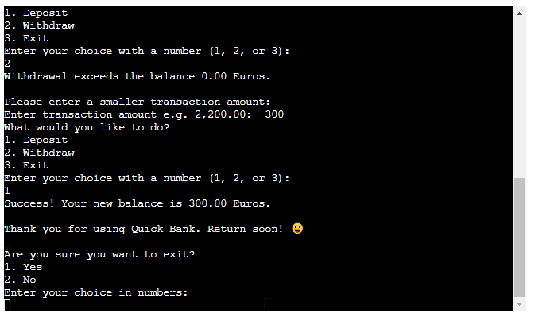

# Quick Bank
Quick Bank is a Python terminal banking application, which runs in the Code Institute mock terminal on Heroku.  

Users can create accounts, make withdrawals, deposits and access their balance. [Here is a live version of the project.](https://p3-bank2-bedbb06cdecb.herokuapp.com/).

- - -

# Table of Contents
# [Quick Bank](#quick-bank)
## [Introduction](#introduction-1)
## [Features](#features-1)
### [Existing Features](#existing-features-1)
### [Features Left to Implement](#features-left-to-implement-1)
## [Design](#design-1)
### [Wireframes](#wireframes-1)
## [Technologies Used](#technologies-used-1)
## [Frameworks, Libraries and Programs](#frameworks-libraries-and-programs-1)
## [Testing](#testing-1)
### [Issues and Bugs](#issues-and-bugs-1)
### [Manual Testing](#manual-testing-1)
## [Deployment and Local Development](#deployment-and-local-development-1)
## [Credits](#credits-1)
### [Code and Media](#code--media-1)
### [Content](#content-1)
## [Acknowledgements](#acknowledgements-1)

# Quick Bank
## Introduction
- This application can be described as a simple banking application.
- The purpose of the application is to help users keep track of deposits, withdrawals and balances. 
- The user demographic includes teen-agers, adults and the elderly - anybody who needs to keep track of their banking accounts. 
- It can also be used for small business owners to help keep track of their banking account transactions.

### Description
- The banking application can be used by anybody who has the need to track bank account withdrawals, deposits and balances. 
- It is easy to understand and the prompts only asks for essential information.

### User Demographic
It is intended for user that need to keep track of their transactions and <b>balances</b> and can be used by the any person who has opened an account and needs to keep track of the balance.

### Instructions
- The user will be prompted to enter the account number which will automatically be converted to lowercase. Alphanumerics can be used up to 15 characters.
- A transaction amount needs to be captured on the next prompt.
- Hereafter the user will be prompted to select a number based on which item on the menu they would like to continue.

## Features
- As a first-time visitor I want a simple, clear and quick user-experience. 
- When I return I want to be able to transact quickly and see what the new balance is. 
- I want the menu to be predictable and easy to navigate.
- I want a forgiving data input standard that won't be rigit about the data I give.

### Existing Features
- The user is prompted with a choice to create a new account if none was found or try to input the account number again.
- Account names are automatically converted to lower case.  This is to prevent case sensitivity and promote user ease of use.

- The user can insert a transaction amount which will automatically round up any more than or less than two decimals places. 

- If the user accidently selects the exit prompt, another prompt ensures that the user has the chance to go back into the menu or go out.  

- The menu is easy to understand and use.
- The old balance and new balance is given.
- The user can easily see how much is in the account if the withdrawal exceeds the balance and can try again.
- The transaction date and time is automatically inserted so that admin charges and interest earned can be calculated later.

- Invalid account names were inserted using the space bar, enter on blanc space, other characters and inputting more than 15 characters. An invalid prompt gave the user the opportunity to try again. Account names are automatically converted to lower case to prevent case sensitivite account names.
- Invalid amounts were given as a transaction amount and the user was again prompted to try and enter a valid amount. Amounts were automatically rounded.
- On the account name prompt the space, other character and a blanc enter was tested to ensure that the user could only use alphanumerics. Default invalid use gives the user another try if selected.
- The account name can only take a maximum of 17 characters.
- The amount also is rounded to prevent user fatigue when inputting invalid formats. It is easy to input. The user also has the option to exit if the wrong amount has been captured before the transaction type is selected.
- A check is prompted for users to prevent withdrawals that exceed the balance. The user is prompted back to the menu when this happen. The current balance is shown so that the user can see how much is available for withdrawal.
- The user can exit the program at several points, making for a <b>forgiving and easy to use user-experience</b>.

### Featues Left to Implement
 - A maximum amount of accounts should be set as a default and perhaps the facility to apply for more accounts.
 - A interest earned calculation can be added by using the date and balance in the data as a reference to calculate interest earned.

## Data Model
- Google sheets is easily accessible and easy to use for account data.
- Today's date is automatically inserted for both security, referencing and future-proofing the accounts for more complicated calculations.

## Testing
The project has been manually tested in the following way:
- The code was passed through a PEP8 linter and no error status is confirmed.
- Given invalid inpts: strings when numbers are expected, out of bounds iputs, same inputs twice.
- Tested in my local terminal and Code Institute Heroku terminal.

### Bugs
#### Solved Bugs
- There were many parameter issues regarding the account name but this was solved with the help of Code Institute student support and my mentor. 
- There were also issues with the balance of the old accounts vs the balance on the new accounts. Atomic, modular code helped to separate the two and deal with them individually to ensure accuracy.

#### Remaining Bugs
- There are no bugs remaining.

### Validator Testing
- Passed the code through a PEP8 linter and confirmed there are no problems.

## Deployment
This project was deployed using the Code Institute's mock terminal for Heroku with the following steps:
- Fork or clone this repository.
- Create a new Heroku app.
- Set the buildbacks to Pyton and Node JS in that order.
- Link the Heroku app to the repository.
- Click on deploy.

## Design
### Wireframes
-  was used to create wireframes that will scale up easily for teamwork. 
- The site has been designed with an "easy to take in" style focussed on avoiding decision fatigue and information overload. The underlined navigation items tells you where you are.  
- Each stroke and click is efficient and intentional.

## Technologies Used
### Language
- Python 3 was used

## Frameworks, Libraries and Programs
- [Git](https://git-scm.com/) was used for version control
- [Github](https://github.com/) wa used to save and store files
- [Lightshot](https://app.prntscr.com/en/index.html) was used for screendumps

### Manual Testing
| Test | Expected Functionality | Actual Behavior | Test Result |
| --- |---                   |---            |---|
| Random URL Load | Redirect User | Redirection executed with 404 page | Test Passed |
| Load on Browsers | Load successfully on Opera, Google Chrome, Microsoft Edge | Loaded successfully | Test Passed |
| Responsive to Varied Devices using Chrome Dev Tools | Tested desktop, tablet iPad Air and Samsung Galaxy A33 | Response Good | Test Passed |
| Buttons | All buttons responded as expected | Quick response and correct calculation | Test Passed |
| Fields Input Range | Text and numbers required | Did not respond | Test Failed |

## Deployment and Local Development

## Credits
### Code and Media
- [Am I Responsive](https://ui.dev/amiresponsive) displays the site on a range of devices.
- [Code Institute Readme Template Tutorial](Code-Institute-Solutions/readme-template)
- [Code Institute Readme from Thomas Tomo](https://github.com/Thomas-Tomo/Lunar-Escape) 
- [Code Institue Readme from Kera Cudmore](https://github.com/kera-cudmore)
- [freeCodeCamp Tutorial](https://www.youtube.com) was used for examples and learning.
- [Favicon](https://favicon.io/favicon-converter/) was used to create the favicon
- [Figjam](https://www.figma.com/) was used for the wireframe
- [Font Awesome](https://fontawesome.com/v4/icons/) was used for all icons 
- [Emoji](https://www.emojipedia.org) was used for hand emojis

### Content
- All content was written by Caylin Dewey

## Acknowledgements
- My mentor,<b> Mitko Bachvarov</b> provided helpful feedback and advice.
- <b>Code Institute </b> Slack community provided solutions and feedback.
- <b>Code Institute </b> tutors were quick to respond to my problems and to assist me - all with very little fuss!
